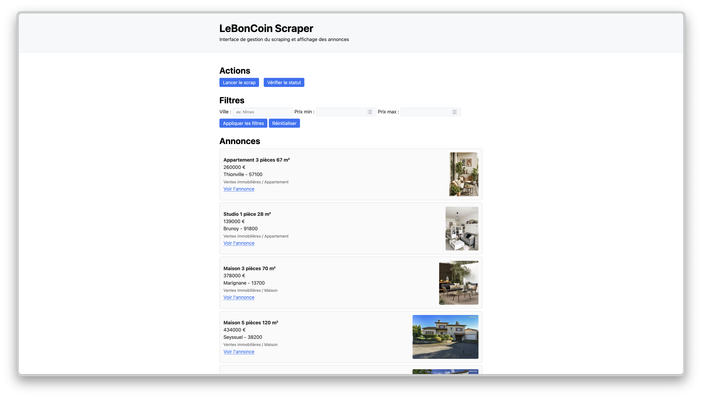

<h1 align="center">LBC Immo Scraper</h1>
<p align="center">
<i>Ce projet est à visée éducative. L'utilisation de ce code pour interroger des sites tiers doit respecter leurs conditions d'utilisation.</i>
</p>

<p align="center">
  
</p>

<p align="center">
  <a href="#description">Description</a> •
  <a href="#contribution">Contribution</a> •
  <a href="#about">About</a> 
</p>

Un outil de scraping permettant de collecter, filtrer et visualiser des annonces du Bon Coin via une interface web légère.

Actuellement, le projet est en développement local et sera déployé ultérieurement.

## Description 
Ce projet a pour but d’automatiser la récupération des annonces depuis LeBonCoin, de les stocker dans une base MySQL, puis de les afficher dans une interface web simple construite avec FastAPI et du JavaScript pur.

L’objectif principal est de disposer d’un outil de veille sur des produits ou biens précis (immobilier, véhicules, matériel, etc.), avec des filtres dynamiques et un tableau de bord centralisé.

## Usage  

### Fonctionnalités
* 	Scraping automatisé des annonces LeBonCoin
*  Stockage des résultats dans une base MySQL
*  Interface web pour filtrer et afficher les annonces
*  Suivi du statut sur demande

### À venir 
* 	Planification automatique du scraping (cron / scheduler)
*  Export CSV / JSON des résultats
*  Dashboard analytique (prix moyen, tendances, etc.)

### Build With
* [Python 3.11+](https://www.python.org/)
* [FastAPI](https://fastapi.tiangolo.com/)
* [MySQL](https://www.mysql.com/)
* [PyMySQL](https://pypi.org/project/PyMySQL/)
* [Uvicorn](https://www.uvicorn.org/)
* [lxml](https://lxml.de/)
* [Jinja2](https://jinja.palletsprojects.com/)


### Déploiement
1. Le code source est poussé sur la branche principale du dépôt GitHub.
2. Une pipeline CI/CD (GitHub Actions) pourra être ajoutée pour :
	•	Lancer les tests automatiques
	•	Construire l’image Docker
	•	Déployer sur le serveur (Render, Railway ou AWS Lightsail)


## Contribution

### How To 

Nous accueillons les contributions avec plaisir ! Pour contribuer :

1. Ouvrez une **[issue](https://github.com/Tchoup7790/lbc-immo-scraper/issues/new)** pour décrire votre problème ou la fonctionnalité que vous aimeriez avoir.

2. Lorsque **l’issue** est approuvée, creez une **branch** pour vos modifications :

```bash
git checkout -b feature/nom-feature
```

3. Ouvrez une **[Pull Request](https://github.com/Tchoup7790/lbc-immo-scraper/compare)** avec une description claire des modifications.

### Structure du projet
```
.
├── main.py                # Point d’entrée FastAPI
├── config/                # Configuration et chargement du .env
├── src/                   # Logique métier (scraper, utils)
├── web/                   # Routes FastAPI, templates et fichiers statiques
│   ├── routes/
│   ├── templates/
│   └── static/
├── db/                    # Script SQL d’initialisation
└── dist/                  # Données de sortie (JSON temporaire)
```

### Pré-requis
Liste des pré-requis nécessaires :

* [Python 3.11+](https://www.python.org/)
* [pip](https://pip.pypa.io/en/stable/)
* [MySQL](https://www.mysql.com/)
* [Virtualenv](https://virtualenv.pypa.io/en/latest/) (recommandé)

### Initialisation du projet 

1. Clonez le dépôt

```bash
git clone https://github.com/Tchoup7790/lbc-immo-scraper
```

2. Accédez au dossier complet
	
```bash
cd ./lbc-immo-scraper
```

3. Installez les dépendances
	
```bash
pip install -r requirements.txt
```

4. Configurer les variables d’environnement
    - Dupliquer le fichier `.env.example` et renommez-le en `.env`.
    - Modifiez les variables d’environnement dans le fichier `.env`.

5. Lancer le projet
	
```bash
python main.py
```

6. Création et population de la Base de données :
	- Lancer votre service de base de données 

	```bash
	brew services start mysql
	```
		
		ou
		
	- Lancer Docker pour la base de données
	
	```bash
	docker-compose up —build
	```


	 Exécutez le fichier **database.sql** pour créer et peupler votre base de données

## À Propos
### Auteurs
* [Tchoup7790](https://github.com/Tchoup7790)

### Contact
Pour toute question ou suggestion, ouvrez une issue ou contactez-moi à [juliojuliobaptiste@gmail.com](mailto:juliojuliobaptiste@gmail.com).

### License 
Ce projet est distribué sous la licence MIT.
Voir le fichier LICENSE pour plus de détails.